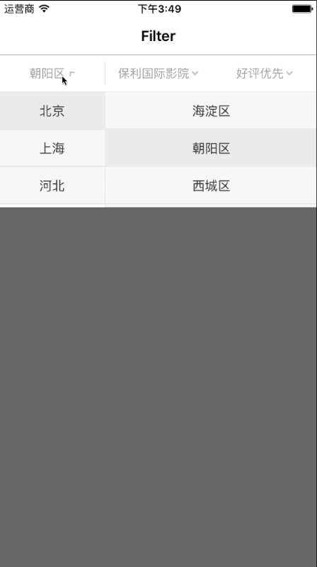

# SGFilterView
A lightweight drop down filter menu with simple APIs
这是一个下拉筛选菜单，使用起来很简单

## Usage

```objc
// 1⃣️ create a instance with -initWithFrame:titles method
SGFilterView *filter = [[SGFilterView alloc] initWithFrame:CGRectMake(0, 64, self.view.bounds.size.width, 44) titles:@[@"FilterOne", @"FilterTwo", @"FilterThree"]];

// 2⃣️ add to super view
[self.view addSubview:filter];

// 3⃣️ config data source & delegate
filter.dataSource = self; // id<SGFilterViewDataSource>
filter.delegate = self; // id<SGFilterViewDelegate>

// 4⃣️ confirm to protocol
@interface SomeViewController () <SGFilterViewDataSource, SGFilterViewDelegate>


// 5⃣️ implement method in data source protocol 
#pragma mark - SGFilterViewDataSource

// like table's -numberOfSectionsInTableView:
// 每个Tab有几列
- (NSInteger)filterView:(SGFilterView *)filterView numberOfColumnForTab:(NSInteger)tab
{
    if (tab == 0) {
        return 2;
    }
    return 1;
}

// 第tab里的第column列的数据，previousRow表示该列的前一列选中的row
- (NSArray *)filterView:(SGFilterView *)filterView dataForColumn:(NSInteger)column inTab:(NSInteger)tab previousSelectedRow:(NSInteger)previousRow
{
    if (tab == 0) {
        if (column == 0) {
            return self.pData;
        } else if (column == 1) {
            return self.cData[previousRow];
        }
    } else if (tab == 1)
    {
        return @[@"所有品牌", @"保利国际影院", @"星美国际影城", @"中影国际影城"];
    } else if (tab == 2)
    {
        return @[@"离我最近", @"好评优先", @"价格最低"];
    }
    return nil;
}

// @optional
// main list is left table
- (CGFloat)filterView:(SGFilterView *)filterView ratioForMainListInTab:(NSInteger)index
{
    if (index == 0) {
        return 1.0/3;
    }
    return 1.0;
}

// 6⃣️ delegate
#pragma mark - SGFilterViewDelegate

- (BOOL)filterView:(SGFilterView *)filterView shouldFoldingOnSelectedRow:(NSInteger)row forColumn:(NSInteger)column inTab:(NSInteger)tab
{
    BOOL foldback = YES;
    if (tab == 0) { // filter one
        if (column == 0) {
            foldback = NO; // 不收回
        }
        
    } else {
        foldback = YES;
        if (tab == 1) { // filter two
            
        } else if (tab == 2) // filter three
        {
            
        }
        
    }

    return foldback;
}

- (BOOL)filterView:(SGFilterView *)filterView shouldChangeTitleOnSelectRow:(NSInteger)row forColumn:(NSInteger)column inTab:(NSInteger)tab
{
    return YES;
}

```

